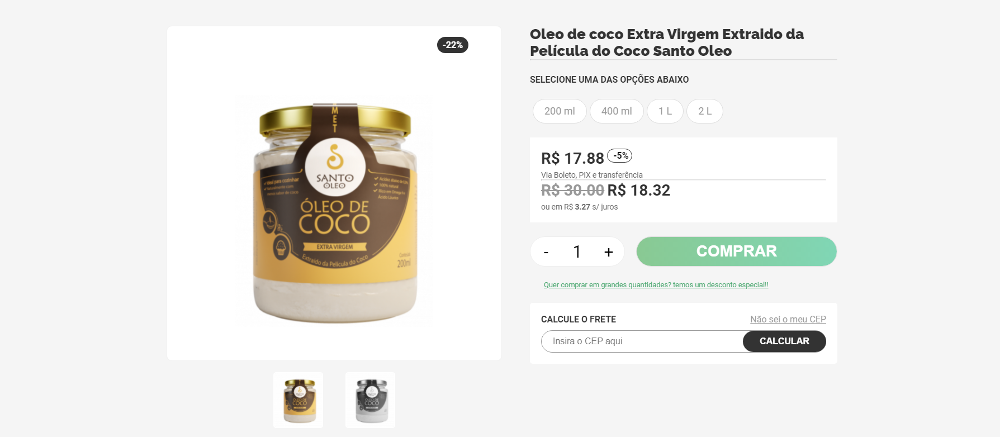

# loja-santo-oleo

#### Página de uma loja de produto fictícia.

<h4 align="center"><a href="https://loja-santo-oleo.vercel.app/">Clique para visitar o projeto</a></h4>

## 📚 Seções

O site é composto por 3 seções diferentes:

- **Principal:** Contém duas imagens do produto, onde é possível selecionar qual a opção e a quantidade que deseja;
- **Detalhes do Produto:** Contém uma descrição sobre o produto;
- **Comentários** Contém os comentários de quem comprou através de um carrossel.

## 🛠️ Tecnologias utilizadas

Para o desenvolvimento deste site utilizei as seguintes tecnologias:

- HTML;
- CSS;
- JavaScript;
